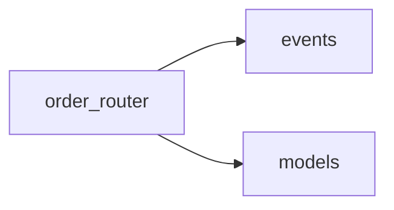

# Output format

This is the canonical format for `docs/code-map.md`. The script `gen_docs.py`
emits this structure already; your only job is to fill the `<!-- describe -->`
placeholders. Do not change headings, ordering, spacing, the dependency graph,
signatures, or call lists.

## Overall structure

1. A top-level title: `# OrderMaster code map`
2. A single dependency-graph section (see below).
3. One `##` section per source file, in alphabetical order by filename.
4. Within each file section, one `###` block per public function or method.

## Dependency graph

A `## Dependency graph` heading followed by one fenced ```mermaid block:



- Direction is always `LR`.
- One edge per line, `<source> --> <target>`, indented four spaces.
- Edges are import-based and intra-package only. Leave them exactly as emitted.

## Per-file section

```
## <filename>.py
Depends on: <module> · <module>
```

- The `Depends on:` line lists intra-package imports, separated by ` · `.
- When a file imports nothing local, the script writes `Depends on: (none)`.

## Per-method block

```
### <ClassName.>method(signature) -> ReturnType
<one-line description>
Calls: <name> · <name>
```

- The heading is the full signature with annotations, exactly as emitted.
  Methods are qualified with their class (`Order.record`); module-level
  functions are not.
- The description line is **the only line you edit**. Replace each
  `<!-- describe -->` with a single sentence stating what the method does.
  Where the script already filled a description from a docstring, leave it.
- Keep descriptions to one line. No implementation detail, no "this method".
  State the behavior: "Validates the transition and advances the order's status."
- `Calls:` is best-effort static analysis — names in call position, which may
  include constructors (`DomainEvent`) and decorators (`post`). Leave it as
  emitted; do not prune or "correct" it. When empty, the script writes
  `Calls: (none)`.

## What not to do

- Do not re-order files or methods.
- Do not merge, split, or re-title sections.
- Do not edit signatures, dependency edges, or call lists — those are
  mechanically extracted and authoritative. Only the descriptions are yours.